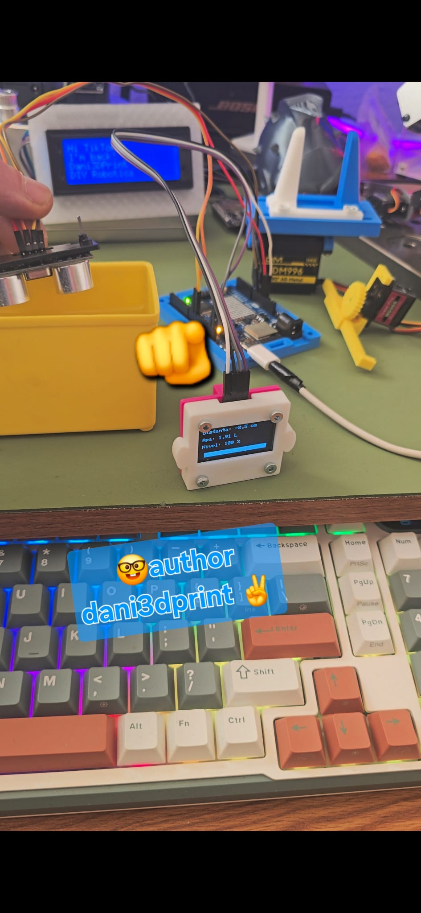

# 💧 Water Level Measurement – Arduino

Arduino project for measuring the water level in a tank using an ultrasonic sensor and displaying the result on an LCD.

---

## 🔧 Features
- Measures water level using ultrasonic sensor (HC-SR04)
- Calculates water height and tank capacity
- Displays values on 16x2 LCD
- Simple and beginner-friendly Arduino code

---

## 🧰 Hardware Required
- Arduino UNO / Nano / Mega
- Ultrasonic Sensor (HC-SR04)
- 16x2 LCD Display
- Jumper wires
- Water tank (test setup)

---

## 📂 Files
- WaterMeasurement.ino – main Arduino sketch
- water-meter.jpg – project photo

---

## ▶️ How to Use
1. Connect the ultrasonic sensor and LCD to Arduino
2. Upload WaterMeasurement.ino to your Arduino board
3. Power the board
4. Water level will be shown on the LCD

---

## 👤 Author
*Dani3DPrint* (dany-ops)

---

## 📜 License
MIT License
